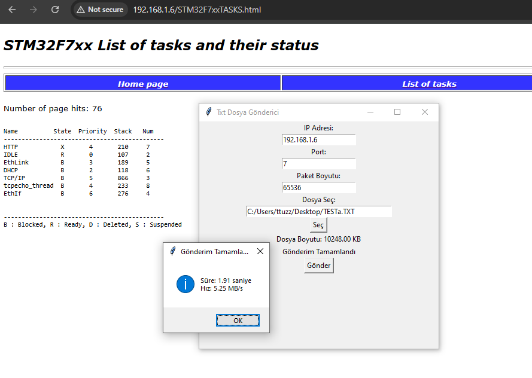
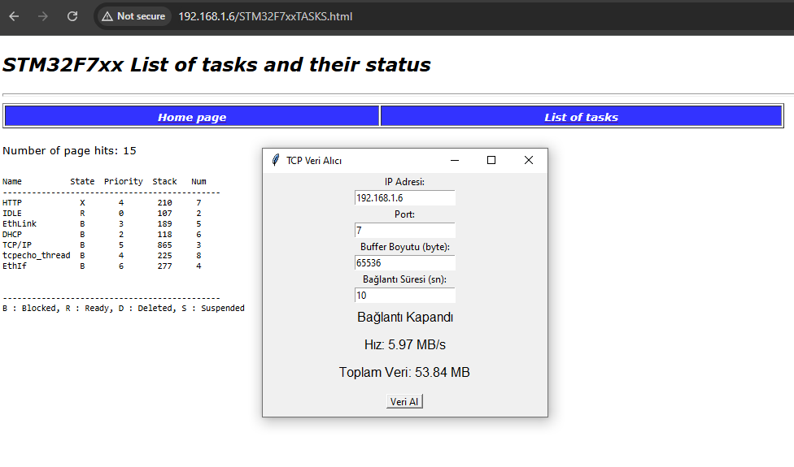

# STM32F746G-DISCO Ethernet

- This contains basic examples for developing network-based applications using the STM32F746G-DISCO development board. 
- The LAN8742 RMII connection is implemented using FreeRTOS and ThreadX.
- In STM32Cube, I couldn't find speed settings for LAN8742, RMII, LWIP, or NetXDuo.
- DHCP is enabled in the projects.
- No special area allocation was made in the linker scripts.

---

## **disco_Lwip_TcpUdp_Echo_Rtos**
- TCP and UDP ECHO on port 7
- LWIP and FreeRTOS
- Writing and reading tests can be performed using Python scripts
  

Speed optimizations were attempted with small changes in buffer settings. Average speeds reached:
- 0.8 MB/s for reading
- 1.0 MB/s for writing

---

## **disco_lwip_tftp_rtos**
- TFTP server application
- LWIP and FreeRTOS
  

---

## **disco_threadX_Tcp_EchoServer**
- TCP ECHO
- ThreadX RTOS 
- NetXDuo Ethernet connector

---

## **LwIP_HTTP_Server_Netconn_RTOS_100mbit**
- This example is a ready-made STM32Cube example for the **STM32F746G-DISCO** board. I made a small modification to test **read and write speeds**.
- The example uses an **older revision** of the LwIP library.
- I couldn't find how to configure the **100 Mbit speed setting** in STM32IDE.

---
