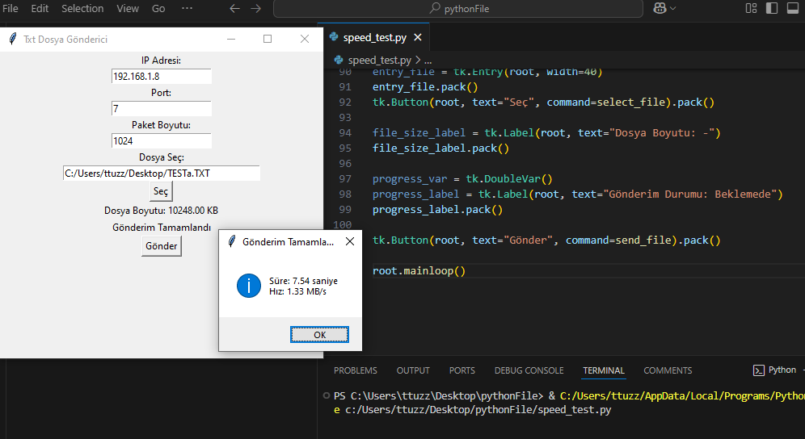
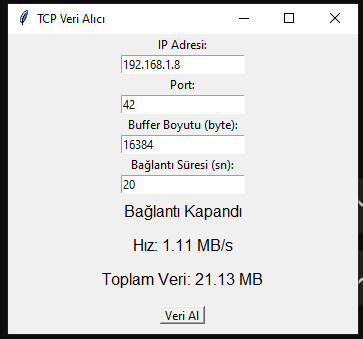
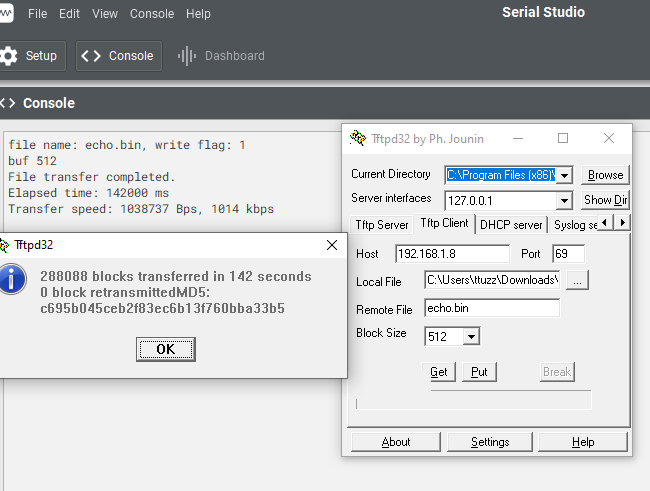
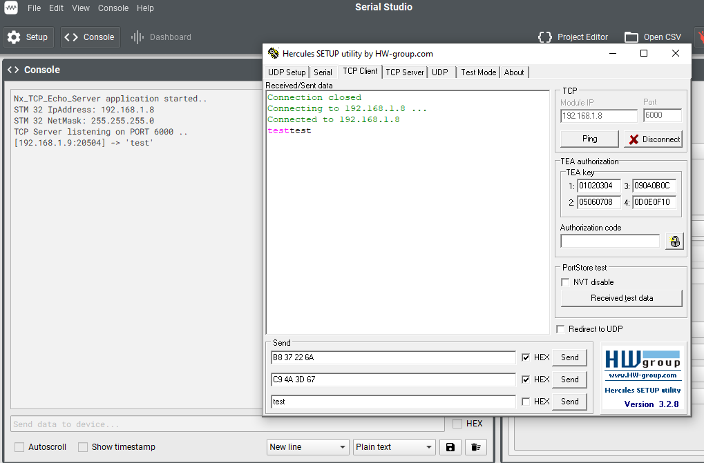

# STM32F746G-DISCO Ethernet

STM32F746G-DISCO geliştirme kartını kullanarak ağ tabanlı uygulamalar geliştirmek için temel örnekler içerir. 
FreeRTOS ve ThreadX kullanılarak ,lan8742 rmii baglantısı gerceklestirildi .
Stm32Ide'de Cube arayuzunde lan8742 yada rmii yada lwip yada netXduo uzerinde hız ayarları bulamadım.
Projelerde dhcp aktif durumda
Linker scripts  lerde ozelbiralan ataması yapılmadı 

---

## **disco_Lwip_TcpUdp_Echo_Rtos**
- TCP ve UDP ECHO port 7
- LWIP ve FreeRTOS
- Ptython stripleri ile yazma ve okuma testleri yapabilirsiniz

buffer ayarlarında kucuk degisikliklerle hız optimizasyonu denendi ortalama olarak 
0.8mb/sn okuma 1.0mb/sn yazma hızlarına ulasılabiliyor

---

## **disco_lwip_tftp_rtos**
- TFTP sunucusu uygulaması.
- LWIP ve FreeRTOS

---

## **disco_threadX_Tcp_EchoServer**
- TCP ECHO
- ThreadX RTOS 
- NetXDuo Ethernet connector

---
